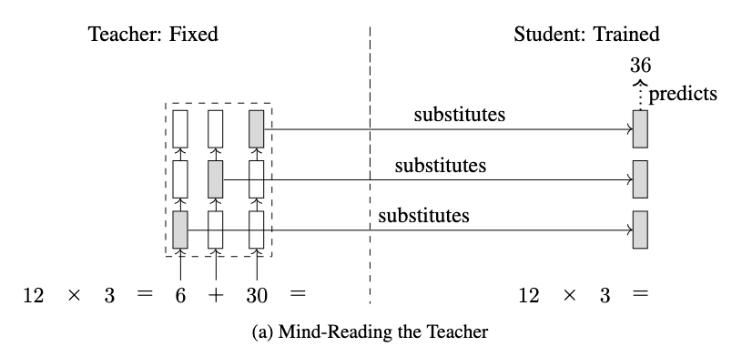
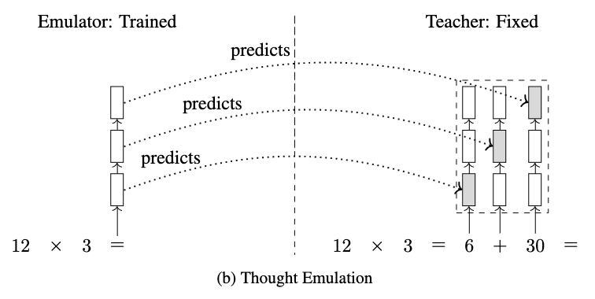
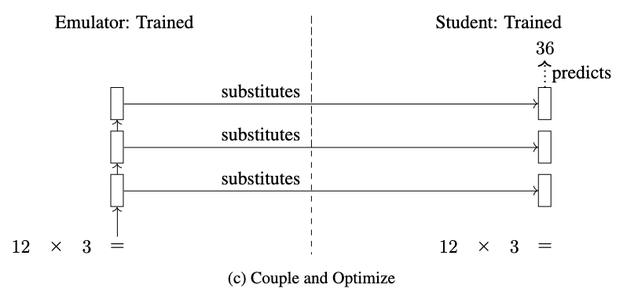

# Implicit Chain of Thought Reasoning via Knowledge Distillation

Here we provide code to reproduce our results.

## Approch to solve the Prof. Deng Challenge: 2 Multlipication at the same time

1. We train the teacher with one multiplication.<br> 
Example of training data: <br>
input:<br> 5 6 3 2 * 7 4 3 4 ||<br>
Chain : <br>5 5 5 6 1 + 0 0 6 4 9 0 ( 5 5 1 1 1 1 ) + 0 0 5 9 0 7 0 ( 5 5 6 0 2 8 0 ) + 0 0 0 0 6 4 9 0 <br>
output: <br>#### 5 5 6 0 8 2 0 1<br>
<br>

2. For the mind-reading teacher which would get data like this: <br>
input: <br>5 6 3 2 * 7 4 3 4 , 6 9 1 5 * 6 4 4 7 || <br>
chain: <br>5 5 5 6 1 + 0 0 6 4 9 0 ( 5 5 1 1 1 1 ) + 0 0 5 9 0 7 0 ( 5 5 6 0 2 8 0 ) + 0 0 0 0 6 4 9 0 , 6 7 1 1 3 + 0 4 8 7 0 2 ( 6 1 0 9 3 2 ) + 0 0 4 8 7 0 2 ( 6 1 4 7 1 3 2 ) + 0 0 0 2 7 3 6 3 <br>
output: <br>#### 5 5 6 0 8 2 0 1 , 6 1 4 9 8 6 8 3<br>
we will use a different method and that is:<br>
training the student to produce the answer using the summed up teacher states of two multplications. <br>

3. Thought_emulator: In the same way thought emulator will learn to predict combined teacher states to feed student using the summed up teacher states. 
## Prerequisites

* [PyTorch](https://pytorch.org/get-started/locally/)
* [transformers](https://github.com/huggingface/transformers) (`pip install transformers`)

## Datasets & Pretrained Models & Logs

All dataset files and log files during inference are included in this repo, with the exception of large training files maintained under Git LFS. Model checkpoints are stored on Google Drive. The folder containing all checkpoints can be found at [this link](https://drive.google.com/drive/folders/1Sclr5bmLZIUcktCaFAeWRTevRGLUwlC_?usp=drive_link).

* 4 X 4 Mult - GPT-2: [data](data/4_by_4_mult/) [model](https://drive.google.com/drive/folders/1Zp-PFwiHkwq0wuFScjN5R8jDdXdnQYQ_?usp=sharing) [log](logs/4_by_4_mult/gpt2/log.generate)
* 4 X 4 Mult - GPT-2 Medium: [data](data/4_by_4_mult/) [model](https://drive.google.com/drive/folders/1B0e67ifTSTTuUg0Sh-of5135Rh4KQ-2v?usp=sharing) [log](logs/4_by_4_mult/gpt2-medium/log.generate)
* 5 X 5 Mult - GPT-2: [data](data/5_by_5_mult/) [model](https://drive.google.com/drive/folders/1lHa2Xey8jJ3__RsYRhcOFHU7Xfqp7XTG?usp=sharing) [log](logs/5_by_5_mult/gpt2/log.generate)
* 5 X 5 Mult - GPT-2 Medium: [data](data/5_by_5_mult/) [model](https://drive.google.com/drive/folders/18dRIynq0j5EBOnKTpOPaLJWCoMBXZYTi?usp=sharing) [log](logs/5_by_5_mult/gpt2-medium/log.generate)
* GSM8K - GPT-2: [data](data/5_by_5_mult/) [model](https://drive.google.com/drive/folders/1aFBBcUr_vHtaDqgpU5A1ErEvrJyX-cEO?usp=sharing) [log](logs/gsm8k/gpt2/log.generate)
* GSM8K - GPT-2 Medium: [data](data/5_by_5_mult/) [model](https://drive.google.com/drive/folders/1zFXfwq5jDjgKpbUVafY5KC0LmJpYXjQK?usp=sharing) [log](logs/gsm8k/gpt2-medium/log.generate)

## Usage

We use 4 X 4 Mult with GPT2-Small as an example. We assume that the working directory is `implicit_chain_of_thought` throughout this document.

### Data Format

The format of training, validation, and test files looks like below:

```
[input 1]||[chain-of-thought 1] #### [output 1]
[input 2]||[chain-of-thought 2] #### [output 3]
[input 3]||[chain-of-thought 2] #### [output 3]
...
```

As an example, let's take a look at the first line from the 4 X 4 Mult test set in [data/4_by_4_mult/test_bigbench.txt](data/4_by_4_mult/test_bigbench.txt):

```
9 1 7 3 * 9 4 3 3||1 7 4 3 3 + 0 6 7 8 4 1 ( 1 3 2 2 8 1 ) + 0 0 7 5 1 1 1 ( 1 3 9 7 9 2 1 ) + 0 0 0 7 5 1 1 1 #### 1 3 9 4 5 4 2 1
```

In this example, the input is `9 1 7 3 * 9 4 3 3` (corresponding to `3719*3349`), the chain-of-thought is `1 7 4 3 3 + 0 6 7 8 4 1 ( 1 3 2 2 8 1 ) + 0 0 7 5 1 1 1 ( 1 3 9 7 9 2 1 ) + 0 0 0 7 5 1 1 1`, and the output is `1 3 9 4 5 4 2 1` (corresponding to `12454931`).

Note that for Teacher Training, (a) Mind-Reading the Teacher, and (b) Thought Emulation, the chain-of-thought steps are used; but for (c) Couple and Optimize the chain-of-thought steps are not used.

### Training

#### Prerequisite: Teacher Training

Our approach is based on distilling a teacher models horizontal reasoning process into the vertical reasoning process of the emulator and the student. Therefore, we need to first train a teacher on the task of explicit chain-of-thought reasoning.

```
export FOLDER=data/4_by_4_mult
export MODEL=gpt2
export EPOCHS=1
export LR=5e-5
export BSZ=32
export SAVE=train_models/4_by_4_mult/gpt2/teacher
echo $SAVE
mkdir -p $SAVE
TOKENIZERS_PARALLELISM=false CUDA_VISIBLE_DEVICES=0 stdbuf -oL -eL python src/train_teacher.py \
    --train_path ${FOLDER}/train.txt \
    --val_path ${FOLDER}/valid.txt \
    --epochs $EPOCHS \
    --lr $LR \
    --batch_size $BSZ \
    --base_model $MODEL \
    --save_model $SAVE \
    > ${SAVE}/log.train 2>&1&
```

#### (a) Mind-Reading the Teacher



```
export FOLDER=data/4_by_4_mult
export DELTA=dynamic
export MODEL=gpt2
export EPOCHS=40
export LR=5e-5
export BSZ=32
export TEACHER=train_models/4_by_4_mult/gpt2/teacher/checkpoint_0
export SAVE=train_models/4_by_4_mult/gpt2/student_initial
mkdir -p $SAVE
TOKENIZERS_PARALLELISM=false CUDA_VISIBLE_DEVICES=0 stdbuf -oL -eL python src/train_mind_reading_student.py \
    --train_path ${FOLDER}/train.txt \
    --val_path ${FOLDER}/valid.txt \
    --epochs $EPOCHS \
    --lr $LR \
    --batch_size $BSZ \
    --base_model $MODEL \
    --teacher $TEACHER \
    --save_model $SAVE \
    --delta $DELTA \
    > ${SAVE}/log.train 2>&1&
```

#### (b) Thought Emulation



```
export FOLDER=data/4_by_4_mult
export DELTA=dynamic
export MODEL=gpt2
export EPOCHS=40
export LR=5e-5
export BSZ=32
export MIXTURE_SIZE=1
export TEACHER=train_models/4_by_4_mult/gpt2/teacher/checkpoint_0
export SAVE=train_models/4_by_4_mult/gpt2/emulator_initial
mkdir -p $SAVE
TOKENIZERS_PARALLELISM=false CUDA_VISIBLE_DEVICES=0 stdbuf -oL -eL python src/train_thought_emulator.py \
    --train_path ${FOLDER}/train.txt \
    --val_path ${FOLDER}/valid.txt \
    --epochs $EPOCHS \
    --lr $LR \
    --batch_size $BSZ \
    --base_model $MODEL \
    --teacher $TEACHER \
    --save_model $SAVE \
    --delta $DELTA \
    --mixture_size ${MIXTURE_SIZE} \
    > ${SAVE}/log.train 2>&1&
```

#### (c) Couple and Optimize



```
export FOLDER=data/4_by_4_mult
export EPOCHS=40
export LR=5e-5
export BSZ=32
export STUDENT=train_models/4_by_4_mult/gpt2/student_initial/checkpoint_6
export EMULATOR=train_models/4_by_4_mult/gpt2/emulator_initial/checkpoint_5
export SAVE=train_models/4_by_4_mult/gpt2/
mkdir -p $SAVE
TOKENIZERS_PARALLELISM=false CUDA_VISIBLE_DEVICES=0 stdbuf -oL -eL python src/train_coupled_emulator_and_student.py \
    --train_path ${FOLDER}/train.txt \
    --val_path ${FOLDER}/valid.txt \
    --epochs $EPOCHS \
    --lr $LR \
    --batch_size $BSZ \
    --student $STUDENT \
    --emulator $EMULATOR \
    --save_model $SAVE \
    > ${SAVE}/log.train 2>&1&
```

### Generation & Evaluation

Here we use a pretrained model as an example. Download the folder `models/4_by_4_mult/gpt2`, then the following command will run inference and evaluate both accuracy and throughput, logged in file `generation_logs/4_by_4_mult/log.generate`.

```
export FOLDER=data/4_by_4_mult
export STUDENT=models/4_by_4_mult/gpt2/student
export EMULATOR=models/4_by_4_mult/gpt2/emulator
export BSZ=1
export SAVE=generation_logs/4_by_4_mult
mkdir -p $SAVE
TOKENIZERS_PARALLELISM=false CUDA_VISIBLE_DEVICES=0 stdbuf -oL -eL python src/generate.py \
    --batch_size $BSZ \
    --test_path ${FOLDER}/test_bigbench.txt \
    --student_path $STUDENT \
    --emulator_path $EMULATOR \
    > ${SAVE}/log.generate 2>&1&
```

## Citation

```
@inproceedings{
    anonymous2023implicit,
    title={Implicit Chain of Thought Reasoning via Knowledge Distillation},
    author={Anonymous},
    booktitle={Submitted to The Twelfth International Conference on Learning Representations},
    year={2023},
    url={https://openreview.net/forum?id=9cumTvvlHG},
    note={under review}
}
```
