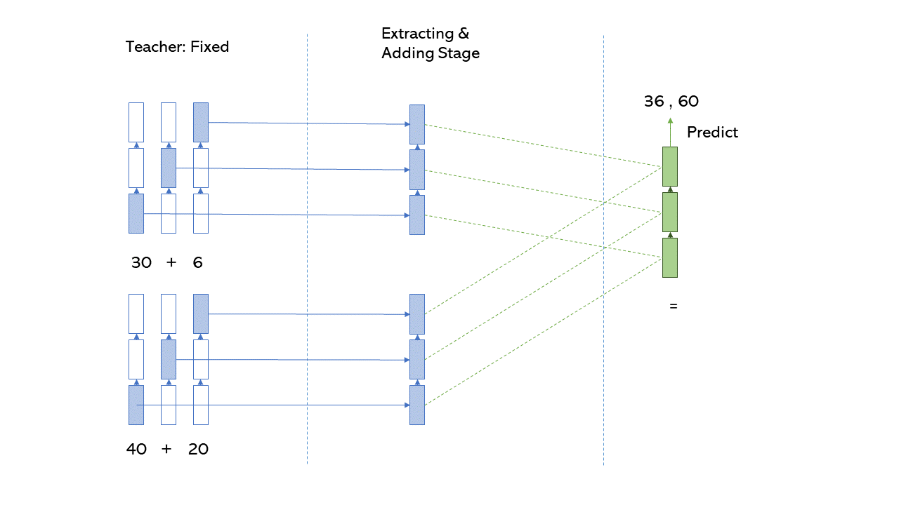
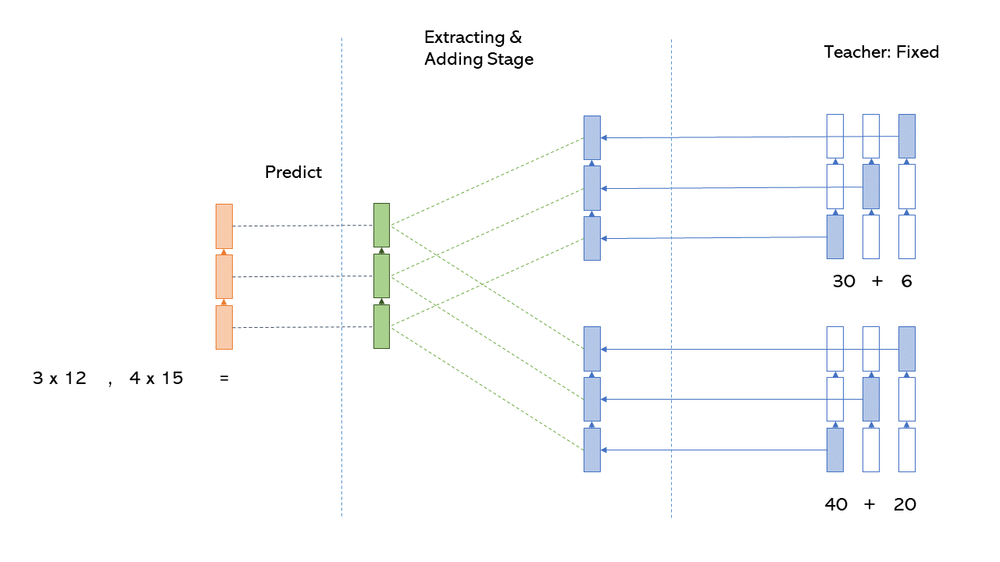
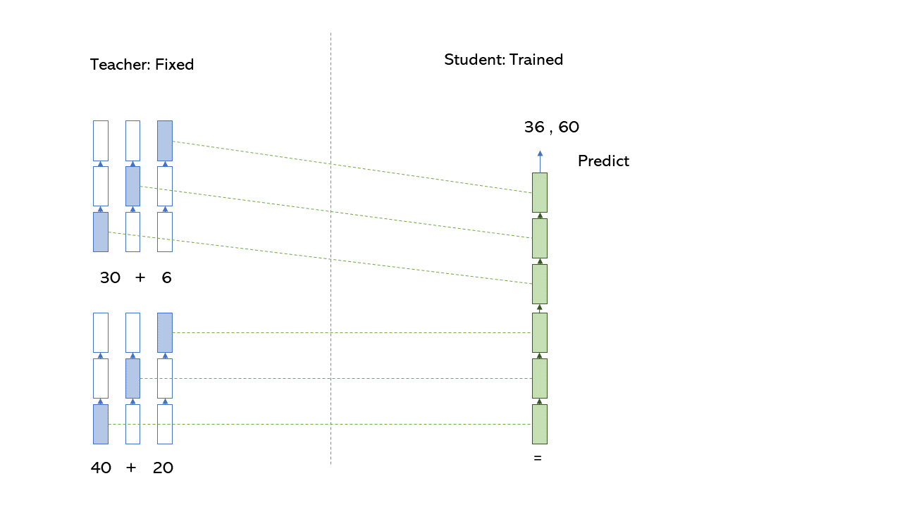

# Two Multiplications Simultaneously w/ ICoT 

This project tries to solve the Prof. Deng challenge to achieve two multiplications at the same time using Implicit Chain of Thought (ICoT). 

## Data Format
The format of training, validation, and test files for training the teaher looks like below:

```
[input 1]||[chain-of-thought 1] #### [output 1]
[input 2]||[chain-of-thought 2] #### [output 3]
[input 3]||[chain-of-thought 2] #### [output 3]
...

```
As an example, let's take a look at the first line from the 4 X 4 Mult test set in [data/4_by_4_mult/test_bigbench.txt](data/4_by_4_mult/test_bigbench.txt):

```
9 1 7 3 * 9 4 3 3||1 7 4 3 3 + 0 6 7 8 4 1 ( 1 3 2 2 8 1 ) + 0 0 7 5 1 1 1 ( 1 3 9 7 9 2 1 ) + 0 0 0 7 5 1 1 1 #### 1 3 9 4 5 4 2 1
```

In this example, the input is `9 1 7 3 * 9 4 3 3` (corresponding to `3719*3349`), the chain-of-thought is `1 7 4 3 3 + 0 6 7 8 4 1 ( 1 3 2 2 8 1 ) + 0 0 7 5 1 1 1 ( 1 3 9 7 9 2 1 ) + 0 0 0 7 5 1 1 1`, and the output is `1 3 9 4 5 4 2 1` (corresponding to `12454931`).

## Approaches

### 1. Summed up hidden states

In this approach, we train the teacher on one multiplication data from original paper. Later, we will use this teachers to extract hidden states. <br>


After training the teacher, we need to combine two rows from original data to create train_combined (or as I called it train 2x2) using the code below. 

``` import re


def combine_rows(row1, row2):
    pattern = re.compile(r"(.+?)\|\|(.+?)####(.+)")
    match_result = pattern.match(row1)
    input_parts1 = match_result.group(1)
    middle_parts1 = match_result.group(2)
    output_parts1 = match_result.group(3)

    match_result = pattern.match(row2)
    input_parts2, middle_parts2, output_parts2 = (
        match_result.group(1),
        match_result.group(2),
        match_result.group(3),
    )

    inputs_combined = " , ".join([input_parts1.strip(), input_parts2.strip()])
    middle_parts_combined = " , ".join([middle_parts1.strip(), middle_parts2.strip()])
    output_combined = output_parts1.strip() + " , " + output_parts2.strip()

    return f"{inputs_combined} || {middle_parts_combined} #### {output_combined}"


def combine_rows_in_file(input_file_path, output_file_path):
    with open(input_file_path, "r") as input_file, open(
        output_file_path, "w"
    ) as output_file:
        rows = [line.strip() for line in input_file]

        for i in range(0, len(rows), 2):
            if i + 1 < len(rows):
                combined_row = combine_rows(rows[i], rows[i + 1])
                output_file.write(combined_row + "\n")


# Example usage:
input_file_path = "train.txt"
output_file_path = "train 2x2.txt"
combine_rows_in_file(input_file_path, output_file_path)
```

Therefore, after the changes the data in train_combined would look like this:
```
[input_1][input_2] || [CoT_1][CoT_2] #### [output_1][output_2]
```
An exmaple of this dataset:
```
5 6 3 2 * 7 4 3 4 , 6 9 1 5 * 6 4 4 7 || 5 5 5 6 1 + 0 0 6 4 9 0 ( 5 5 1 1 1 1 ) + 0 0 5 9 0 7 0 ( 5 5 6 0 2 8 0 ) + 0 0 0 0 6 4 9 0 , 6 7 1 1 3 + 0 4 8 7 0 2 ( 6 1 0 9 3 2 ) + 0 0 4 8 7 0 2 ( 6 1 4 7 1 3 2 ) + 0 0 0 2 7 3 6 3 #### 5 5 6 0 8 2 0 1 , 6 1 4 9 8 6 8 3
```

The idea to solve the problem is to find the hidden states of each multiplication separately, and add them together. Hence, in the <b>Second Step</b> we train a mind-reading student to predict outputs using summed up hidden states. <br>



<b> Third Step </b> would be training an emulator to predict summed up hidden states. <b> <br>



<br>
Fourth Step </b> is to combine the emulator and student to predict answers. 

<b> Note: </b> The advantage of this technique is its flexibility. For instance, we can find the dot product of hidden states instead of adding them or we can use any other function. 

### 2. Stacking hidden states

In this approach, after extracting the hidden states from each mulitplication, instead of adding them together, we would stack and append them together and create a list of hidden states with twice the length. After that, we teach the student to predict answers using stacked hidden states.



### Note: 
In the original paper of Implicit Chain of Thought, the authors took only one hidden states from each layers using different methods, for example, they would select them diagonaly or dynamicly according to a formula. However, these methods are not guaranteed to yeild the best results in our cases. 


